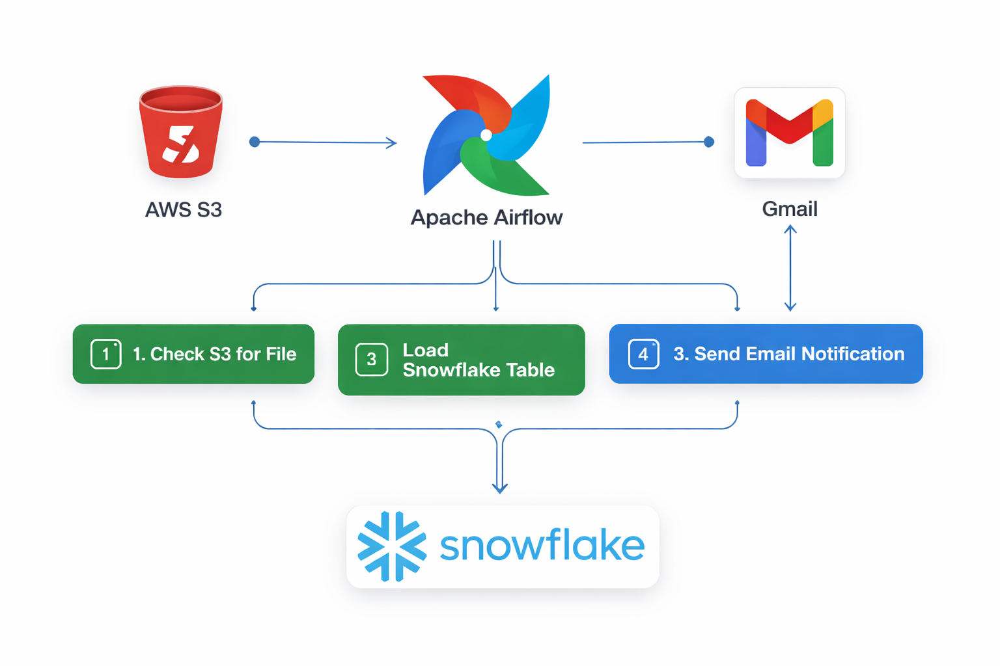

<div align="center">

<h1>☁️ Airflow S3 Snowflake ETL Email Pipeline</h1>

<p>
<b>Cloud data engineering pipeline for checking files in AWS S3, loading CSV data into Snowflake, and sending automated email notifications using Apache Airflow.</b>
</p>

<p>


</p>

</div>

---



## 📌 Project Overview

This project demonstrates an end-to-end **cloud ETL workflow** using **Apache Airflow**, **AWS S3**, **Snowflake**, and automated **email notification**.

The Airflow DAG checks whether a CSV file is available in an S3 bucket, creates or refreshes a Snowflake table, loads the CSV data into Snowflake using `COPY INTO`, and sends an email notification after the pipeline completes successfully.

The project is structured as a practical data engineering workflow focused on orchestration, cloud storage integration, warehouse loading, task dependencies, and pipeline completion alerts.

---

## 🎯 Objectives

- Build an Airflow DAG for cloud ETL orchestration
- Check CSV file availability in AWS S3 using `S3KeySensor`
- Create or refresh a target Snowflake table
- Load CSV data from an external Snowflake stage
- Automate email notification after successful ETL completion
- Practice Airflow task dependencies and provider integrations
- Demonstrate a portfolio-ready data engineering pipeline

---

## 🔄 Pipeline Workflow

```text
AWS S3 Bucket
      │
      ▼
S3 CSV File Check
      │
      ▼
Airflow S3KeySensor
      │
      ▼
Snowflake Table Creation
      │
      ▼
COPY INTO Snowflake Table
      │
      ▼
Email Notification
```

---

## 📁 Project Structure

```text
Airflow-S3-Snowflake-ETL-Email/
│
├── airflow_snowflake_s3_email.py      # Airflow DAG file
├── airflow-s3-snowflake-etl-email.png # Pipeline architecture image
├── README.md                          # Project documentation
├── LICENSE                            # MIT license
└── .gitignore                         # Git ignored files
```

---

## 🧩 DAG Overview

The Airflow DAG is named:

```text
snowflake_s3_with_email_notification_etl
```

The DAG runs on a daily schedule and performs four main tasks.

| Task ID | Description |
|---|---|
| `tsk_is_file_in_s3_available` | Checks whether the required CSV file exists in AWS S3 |
| `create_snowflake_table` | Creates or refreshes the target Snowflake table |
| `tsk_copy_csv_into_snowflake_table` | Loads CSV data from Snowflake external stage into the table |
| `tsk_notification_by_email` | Sends an email notification after successful pipeline execution |

---

## 📊 Target Data

The pipeline loads city-level CSV data into a Snowflake table named `city_info`.

| Column | Description |
|---|---|
| `city` | City name |
| `state` | State name |
| `census_2020` | 2020 census population value |
| `land_area_sq_mile_2020` | Land area in square miles |

---

## ❄️ Snowflake Requirements

The DAG expects the following Snowflake objects to be configured:

```text
DATABASE: city_database
SCHEMA: new_city_schema
STAGE: snowflake_ext_stage_yml
FILE FORMAT: csv_format
TABLE: city_info
```

Target table structure:

```sql
CREATE TABLE IF NOT EXISTS city_info (
    city TEXT NOT NULL,
    state TEXT NOT NULL,
    census_2020 NUMERIC NOT NULL,
    land_area_sq_mile_2020 NUMERIC NOT NULL
);
```

---

## 🔐 Required Airflow Connections

Create the following connections inside the Airflow UI before running the DAG.

### AWS S3 Connection

```text
Connection ID: aws_s3_conn
Connection Type: Amazon Web Services
```

Add your AWS access key, secret key, and region according to your Airflow environment.

### Snowflake Connection

```text
Connection ID: conn_id_snowflake
Connection Type: Snowflake
```

Add your Snowflake account, warehouse, database, schema, role, username, and password.

---

## 📧 SMTP Email Configuration

Email notification can be configured in `airflow.cfg`.

```ini
[smtp]
smtp_host = smtp.gmail.com
smtp_starttls = True
smtp_ssl = False
smtp_user = your_email@gmail.com
smtp_password = your_gmail_app_password
smtp_port = 587
smtp_mail_from = your_email@gmail.com
```

> Use a Gmail App Password instead of your normal Gmail password.

---

## 🚀 How to Run

### 1. Clone the repository

```bash
git clone https://github.com/CodeByMan/Airflow-S3-Snowflake-ETL-Email.git
cd Airflow-S3-Snowflake-ETL-Email
```

### 2. Install required Airflow providers

```bash
pip install apache-airflow-providers-amazon
pip install apache-airflow-providers-snowflake
```

### 3. Move DAG file to Airflow DAGs folder

```bash
cp airflow_snowflake_s3_email.py ~/airflow/dags/
```

### 4. Configure Airflow connections

Create these connection IDs in the Airflow UI:

```text
aws_s3_conn
conn_id_snowflake
```

### 5. Configure SMTP email settings

Update your Airflow SMTP configuration in `airflow.cfg` or environment variables.

### 6. Upload CSV file to S3

The DAG checks this S3 path:

```text
s3://airflow-snow-email-buckets/city_folder/us_city.csv
```

### 7. Start Airflow services

```bash
airflow webserver
airflow scheduler
```

### 8. Enable and run the DAG

Open the Airflow UI, enable the DAG, and trigger:

```text
snowflake_s3_with_email_notification_etl
```

---

## 🛠️ Technologies Used

| Technology | Purpose |
|---|---|
| Python | DAG development |
| Apache Airflow | Workflow orchestration |
| Airflow S3KeySensor | S3 file availability check |
| AWS S3 | Cloud storage source |
| Snowflake | Cloud data warehouse |
| SnowflakeOperator | Snowflake SQL execution |
| COPY INTO | Data loading into Snowflake |
| EmailOperator | Pipeline completion notification |
| Gmail SMTP | Email delivery |

---

## ✅ Key Learning Outcomes

- Creating Airflow DAGs with task dependencies
- Using sensors to monitor cloud storage files
- Integrating Airflow with AWS S3
- Running Snowflake SQL from Airflow
- Loading staged CSV data into Snowflake tables
- Sending automated email notifications from Airflow
- Building a simple production-style ETL workflow

---

## 👤 Author

**Muhammad Ali Nawaz**  
Cloud Data Engineer

---

## 📄 License

This project is licensed under the [MIT License](LICENSE).

---

<p align="center">
<b>⭐ If you found this project useful, consider giving it a star!</b>
</p>
